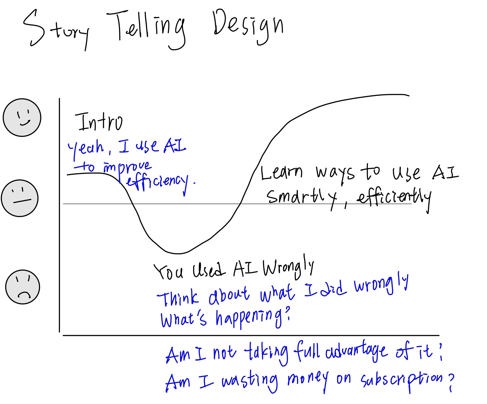

| [Home Page](https://joannachang1028.github.io/JoannaChang-dataviz-portfolio/) | [Visualizing Government Debt](visualizing-government-debt) | [Critique by Design](critique-by-design) | [Final project I](final-project-part-one) | [Final project II](final-project-part-two) | [Final project III](final-project-part-three) |

# The AI Usage Gap: Are We Really Using AI the Way We Want To?

# Outline

## 1. High-Level Summary

Artificial intelligence (AI) has rapidly transitioned from a specialized technology to a mainstream tool influencing how people work, learn, communicate, and make decisions. The number of AI tool users worldwide has grown dramatically since 2020, demonstrating widespread adoption across the general population.

At the same time, AI skills have become increasingly important for employers. In fact, two-thirds of U.S. leaders report that they would not hire someone who lacks AI literacy. This shift underscores the urgency for individuals to improve their AI skills—not only to stay competitive professionally, but also to enhance personal efficiency and problem-solving.

However, data shows a significant gap between how Americans currently use AI and how they want AI to support them. While many adults use AI for simple tasks, they express a strong desire for AI to assist with deeper functions such as complex decision-making, personal well-being, and productivity enhancement.

This final project aims to tell a clear data-driven story that answers:
- How AI became integrated into everyday life
- How people use AI today
- What people wish AI could do for them
- Ways individuals can maximize AI’s benefits
- Practical tools people should learn to improve efficiency in both work and daily life

The project will conclude by challenging readers:
“Are you truly using AI effectively—or just casually?”

## 1.2 Project Structure

**Section 1 — AI Is Already Everywhere
- Evidence: Rapid global growth of AI tool users from 2020–2031
- Visualization: Line chart showing millions of users worldwide (2020–2031)
- Message: AI has already become a universal tool
- Source: Statista. (July 1, 2025). Number of AI tool users worldwide from 2020 to 2031 (in millions). Retrieved November 18, 2025, from https://www.statista.com/forecasts/1449844/ai-tool-users-worldwide

**Section 2 — Employers Expect AI Skills
- Evidence: 67% of U.S. leaders would not hire someone without AI skills
- Visualization: Bar chart visualizing employer expectations
- Message: AI literacy is now a professional requirement
- Citation: Fleck, A. (January 15, 2025). 2 in 3 Leaders Would Not Hire Someone Without AI Skills [Digital image]. Retrieved November 18, 2025, from https://www.statista.com/chart/33761/knowledge-workers-on-hiring-someone-with-ai-skills/

**Section 3 — The AI Gap: Usage vs. Expectations
- Actual Usage: What Americans Do with AI
  - Visualization: Chart showing where U.S. adults intend to use generative AI (primarily simple tasks)
  - Citation: Activate. (October 10, 2023). Intention of generative artificial intelligence (GAI) usage by adults in the United States as of August 2023, by type [Graph]. Retrieved November 18, 2025, from https://www.statista.com/statistics/1461998/usa-generative-ai-usage-intention-by-type/
- Desired Support: What Americans Wish AI Could Do
  - Visualization: Chart showing Americans want AI to assist with productivity, decision-making, and personal well-being
  - Citation: Richter, F. (November 7, 2025). How Americans Want AI to Support Them [Digital image]. Retrieved November 18, 2025, from https://www.statista.com/chart/35426/how-americans-want-ai-to-support-them/
- Message: There is a clear disconnect between how Americans actually use AI (simple tasks) and how they wish AI would help (advanced support & decision-making). This “AI usage gap” becomes the central narrative turning point.

**Section 4 — What AI Tools Should You Learn?
To close the gap and help people (graduate student) live more efficiently and effectively, the project will recommend essential AI tools across three categories:

1. **AI as a Learner**

   * **NotebookLM** — Helps synthesize readings, summarize concepts, and create personalized study guides.

2. **AI for Note-taking**

   * **Notion AI** — Organizes notes, generates outlines, and supports productivity workflows.
   * **Fathom AI** — Records and summarizes meetings for quick review.

3. **AI for Job Applications**

   * **Simplify Copilot** — Automates application steps and tracks progress.
   * **ChatGPT (Prompt Engineering)** — Customizes resumes and cover letters for specific roles.

| Category                    | Tool                             | What It Helps You Do                                                             |
| --------------------------- | -------------------------------- | -------------------------------------------------------------------------------- |
| **AI as a Learner**         | **NotebookLM**                   | Synthesizes readings, summarizes concepts, and builds personalized study guides. |
| **AI for Note-taking**      | **Notion AI**                    | Organizes notes, generates outlines, and supports task workflows.                |
|                             | **Fathom AI**                    | Records, transcribes, and summarizes meetings for quick review.                  |
| **AI for Job Applications** | **Simplify Copilot**             | Automates repetitive application steps and tracks job submissions.               |
|                             | **ChatGPT (Prompt Engineering)** | Customizes resumes and cover letters based on job descriptions.                  |

Taken together, these tools provide a practical, achievable learning path for anyone hoping to close their personal AI usage gap. By incorporating AI into learning, daily organization, and career development, individuals can shift from **casual** use of AI to **intentional, skill-building** use—ultimately unlocking the full potential of AI as a partner in learning, productivity, and professional growth.

## Story Telling Desgin - How Readers Feel Through the Presentation

# The data

## 2.1 Overview of the Dataset

Primary dataset:
- American Trends Panel (ATP) Wave 152 — Pew Research Center

This nationally representative dataset provides insights on how U.S. adults perceive, use, and interact with AI. It offers strong methodological reliability and high sample validity.

Methodological details:
- Field dates: Aug 12–18, 2024
- Sample size: n = 5,410
- Response rate: 91%
- Margin of error: ±1.6 percentage points
- Oversampled groups: Hispanic men, non-Hispanic Black men, non-Hispanic Asian adults
- Interviews conducted online (n = 5,195) and by phone (n = 215)
- Languages: English and Spanish
- Weighted to U.S. adult population proportions

Dataset link:
https://www.pewresearch.org/dataset/american-trends-panel-wave-152/

## 2.2 How I Plan to Use the Data

The dataset includes a rich set of questions about AI familiarity, AI usage habits, trust, helpfulness, and frequency of interaction. I will use the following questions to build key visualizations:
- How much have you heard about AI chatbots?
- Have you ever used an AI chatbot like ChatGPT, Gemini, or Copilot?
- Overall, how helpful have AI chatbots been for you?
- How often do you interact with AI?
- How much control do you feel you have over whether AI is used in your life?

These data points will be used to:
- Build current AI usage fact charts
- Support each section of the story arc
- Illustrate behavioral differences and perceptions across demographic groups
- Highlight gaps in adoption and expectations (the “AI usage gap”)

# Initial sketches

Below are the initial concept sketches that will guide the eventual data visualizations. 
These written descriptions explain the structure, data source, and storytelling purpose behind each visualization.

## Sketch 1 — U.S. AI Awareness & Adoption (Dual Panel)

Replaces the previous “Global AI User Growth” sketch, since the Pew dataset does not include global user forecasts.

### Left Panel — Awareness of AI Chatbots

- Visualization type: Stacked bar chart  
- Pew question: “How much have you heard about artificial intelligence (AI) chatbots like ChatGPT, Gemini or Copilot?”

Response levels:
- A lot
- A little
- Nothing at all

Design notes:
- Order bars from “A lot → Nothing at all.”
- Use stronger/darker colors for higher awareness levels.
- Optional: add demographic filters (age, education, employment, political ideology).

### Right Panel — Ever Used an AI Chatbot

- Visualization type: Vertical bar chart  
- Pew question: “Have you ever used an artificial intelligence (AI) chatbot like ChatGPT, Gemini or Copilot?”

Bars:
- Yes
- No

Design notes:
- Keep it simple; emphasize the adoption rate.
- Optional demographic dropdowns to show adoption gaps.

Story message:
Americans are increasingly aware of AI—but awareness does not automatically translate into usage. This visualization establishes the starting point of the story: many people know AI exists, yet fewer actually use it.

## Sketch 2 — Control Over How AI Is Used in Your Life

- Visualization type: Horizontal bar chart  
- Pew question: “How much control do you think you have in whether artificial intelligence (AI) is used in your life?”

Response categories:
- I’d like more control
- Not sure
- I’m comfortable
- Refused

Design notes:
- Use darker / more saturated colors for “I’m comfortable.”
- Use lighter / muted colors for “Not sure” and “Refused.”
- Emphasize “I’d like more control” since this is a key emotional anchor that supports your story’s turning point (the gap between current AI experiences and desired AI support).
- Include percentage labels for clarity.

Story message:
Many adults feel uncertain or powerless about how AI affects their everyday lives. This chart visualizes the emotional landscape behind AI usage and sets up the narrative tension for later sections (the AI usage gap + why new skills/tools matter).

# Method and Medium

For the final deliverable, I will use:
- Shorthand
  - To create an interactive, scroll-based narrative
  - To integrate text, visuals, and design elements seamlessly
- Tableau
  - To produce polished, interactive data visualizations
  - To embed charts directly into Shorthand
  - To ensure visual clarity and consistency

All datasets, cleaned data files, and final charts will be stored in this GitHub repository with proper citations. Visual assets (sketches and exports) will be committed to a designated assets/ directory.

The final website will be a fully interactive narrative that combines:
- Embedded Tableau charts
- Static PNG/SVG exports (for cross-platform compatibility)
- Short explainer text blocks and interactive call-to-action elements

## References
- Statista. (July 1, 2025). Number of AI tool users worldwide from 2020 to 2031 (in millions). Retrieved November 18, 2025, from https://www.statista.com/forecasts/1449844/ai-tool-users-worldwide
- Fleck, A. (January 15, 2025). 2 in 3 Leaders Would Not Hire Someone Without AI Skills [Digital image]. Retrieved November 18, 2025, from https://www.statista.com/chart/33761/knowledge-workers-on-hiring-someone-with-ai-skills/
- Activate. (October 10, 2023). Intention of generative artificial intelligence (GAI) usage by adults in the United States as of August 2023, by type [Graph]. Retrieved November 18, 2025, from https://www.statista.com/statistics/1461998/usa-generative-ai-usage-intention-by-type/
- Richter, F. (November 7, 2025). How Americans Want AI to Support Them [Digital image]. Retrieved November 18, 2025, from https://www.statista.com/chart/35426/how-americans-want-ai-to-support-them/
- Pew Research Center. American Trends Panel (ATP) Wave 152 dataset. https://www.pewresearch.org/dataset/american-trends-panel-wave-152/

## AI acknowledgements
I used AI to help organize and proofread the text in this document.

All substantive research decisions, data selection, analysis plans, and visualization choices were made by me. AI assistance was limited to editing and drafting text; no AI was used to generate data or perform analysis without my oversight. I have reviewed and edited all text produced with AI for accuracy and voice consistency.
